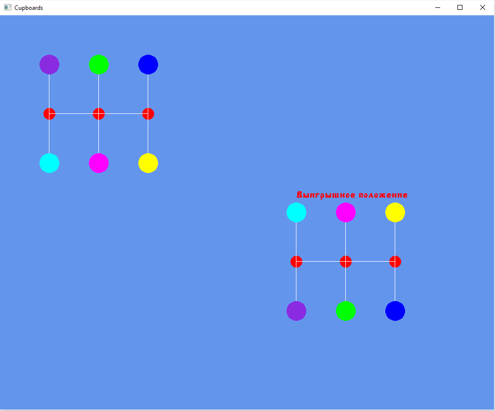

# Игра пятнашки

# Описание 

Это игра в пятнашки написанная на языке С++ с использованием библиотеки SFML. Цель игры передвинуть фишки таким образом, чтобы их расположение совпало с заданм выигрышным положением. Фишки двигаются плавно по заданной траектории и управляются с помощью мыши. Игра считывает поле и первоначальное положение фишек из файла.

## Скриншоты из игры

